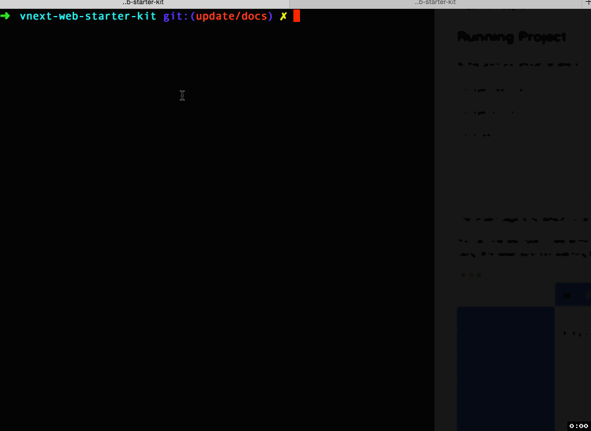
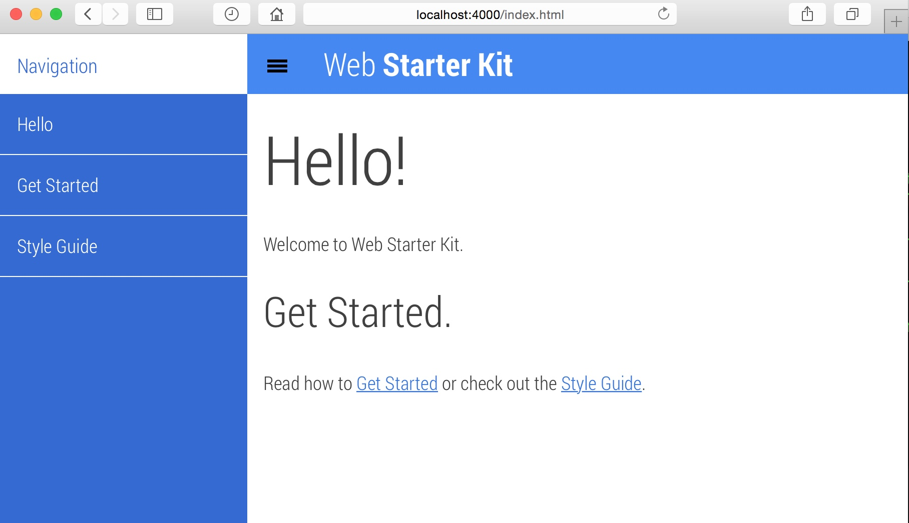

#vNext Web Starter Kit
==================

:apple: Google Web Starter Kit as vNext project scaffolded with Yo's generator-aspnet. Lot's of Node, JSON, JavaScript, client-side code - no Visual Studio IDE involved.

Why?
> That said, you can also try out ASP.NET vNext with just a command-prompt and a text editor.

Yes, let's try:




## Contents
* [vNext Environment Installation](#vnext-environment-installation)
* [Scaffold Project](#scaffold-project)
* [Running Project](#running-project)

## vNext Environment Installation

The entire process of installing the new `K Runtime Environment (KRE)`, `K Version Manager (KVM)` - required to run vNext projects on from a command line, is described on `Home` project page: [https://github.com/aspnet/Home/](https://github.com/aspnet/Home/)

If you are using @oh-my-zsh on OS 10.* 'Yosemite' please use tips from this issue to fix vNext `cli` integration problems:
[https://github.com/aspnet/kvm/issues/83](https://github.com/aspnet/kvm/issues/83#issuecomment-63178442), [https://github.com/aspnet/kvm/issues/83#issuecomment-63178442](https://github.com/aspnet/kvm/issues/83#issuecomment-63178442).

## Scaffold Project

This project starting web code was scaffolded by using @yeoman based @OmniSharp's [generator-aspnet](https://github.com/OmniSharp/generator-aspnet) just by running:

```bash
yo aspnet
```

## Running Project

At this point you should be able to run scaffolded application with these steps:

```
$ kpm restore  
[...]  
$ kpm build  
[...]
$ k watch
[...]
```

> Note: this project uses `kmon` command [https://github.com/henriksen/kmon](https://github.com/henriksen/kmon) which depends on `nodemon`. So make sure that you have installed `nodemon` before running this project:
> ```
> npm install -g nodemon
> ```

The project page is by default run at 'http://localhost:3000/index.html'.

You can now also type in new terminal window:
```
gulp
```
and this will start new browser window using @browser-sync tool watching for changes in project directory:




